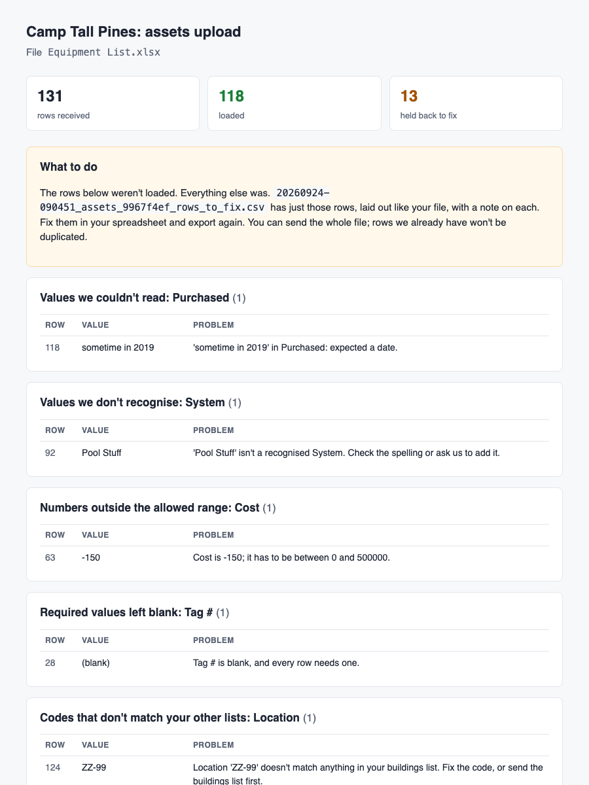
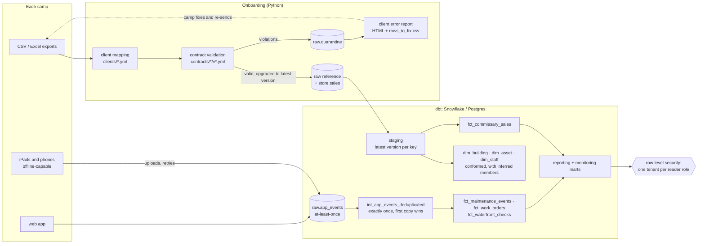

# CampCommand data platform

[](https://github.com/eric-rosenbaum/campcommand-data-platform/actions/workflows/ci.yml)
[](https://eric-rosenbaum.github.io/campcommand-data-platform/)
[](https://eric-rosenbaum.github.io/campcommand-data-platform/error-report.html)

[CampCommand](https://www.campcommand.app/) is operations software for summer
camps: maintenance and repairs, assets, waterfront safety checks, and the camp
store. I'm the technical co-founder (two-person team) and built its data
platform. The product code is private, so this repo rebuilds the data layer
from scratch on synthetic data. The problems and the approach are the ones I
worked on; the code, the data and some implementation details are new.

Every camp is a tenant. Each one arrives with its own spreadsheets, and staff
log work on phones that are offline half the time. The platform has to turn
that into one warehouse where each camp sees only its own data.

**Stack:** Snowflake (production) · PostgreSQL (local and CI) · dbt Core · Airflow 3 · Python 3.12 · SQLAlchemy

| What it does | Where to look |
| --- | --- |
| **Multi-tenant dimensional warehouse.** Event and transaction facts share conformed building, asset and staff dimensions. Every table is isolated per tenant by row-level security policies. | [`models/marts`](warehouse/models/marts), [`tenant_isolation.sql`](warehouse/macros/tenant_isolation.sql), [`test_tenant_isolation.py`](tests/integration/test_tenant_isolation.py) |
| **Client onboarding framework.** Takes each camp's CSV and Excel exports and maps them into one schema, using per-client column mapping, type coercion and referential validation, with a separate error report for each client. | [`clients/`](clients), [`src/campcommand`](src/campcommand), [`test_onboarding.py`](tests/integration/test_onboarding.py) |
| **Versioned data contracts** for each feed. Rows that break a contract go to quarantine, and the client gets an automated error report. Clients fix and re-send their own data; rows that come back clean are resolved automatically. | [`contracts/`](contracts), [`validation.py`](src/campcommand/validation.py), [`reports.py`](src/campcommand/reports.py) |
| **Reconciliation for events that arrive late or out of order** from offline mobile devices and the web app. Idempotent event keys and event-time windowing mean no duplicate records. | [`int_app_events_deduplicated`](warehouse/models/intermediate/int_app_events_deduplicated.sql), [`fct_work_orders`](warehouse/models/marts/core/fct_work_orders.sql), [`test_event_reconciliation.py`](tests/integration/test_event_reconciliation.py) |

## Run it

Needs Docker and Python 3.11+. No Snowflake account needed: the same dbt
project runs against Postgres locally (see [below](#snowflake-and-postgres)).

```bash
python -m venv .venv && source .venv/bin/activate
make install
make demo      # bootstrap, two rounds of client files, a season of device events, dbt build
make test      # unit + integration tests
```

The demo plays out onboarding for three camps. **Round 1** is their first
exports: a New Hampshire camp on CSVs and an Excel sheet with title rows, a
Michigan camp on Excel throughout, and a Quebec camp whose system writes
Latin-1, semicolon-delimited files with French headers, day-first dates and
decimal commas. Each export has the kinds of mistakes hand-kept spreadsheets
have, and one weekly store export per camp is missing a column entirely.

```
tall_pines   Facilities.csv                  loaded_with_errors     28 loaded    3 held
tall_pines   Equipment List.xlsx             loaded_with_errors    118 loaded   13 held
tall_pines   POS Export 2026-07-12.csv       loaded_with_errors  1,407 loaded    6 held
tall_pines   POS Export 2026-08-02.csv       rejected                0 loaded 1378 held
tall_pines   POS Export 2026-08-09.csv       loaded              1,304 loaded    0 held  93 resolved
...
```

Each camp gets a report written for its director, in the camp's own column
names, plus a CSV of just the rows to fix
([live example](https://eric-rosenbaum.github.io/campcommand-data-platform/error-report.html)):



**Round 2**: the camps fix what the reports flagged and export again. The
quarantine closes itself out:

```
camp               feed                     files rejected   loaded   held  fixed  open
---------------------------------------------------------------------------------------
Camp Tall Pines    assets                       2        0      249     13     12     1
Camp Tall Pines    buildings                    2        0       58      3      3     0
Camp Tall Pines    commissary_transactions     11        1   13,307  1,384  1,384     0
Camp Tall Pines    staff                        2        0      175      3      3     0
```

The one row left open is an asset with a blank tag. With no key, it can't
be matched to a resend, so a person has to close it.

## Architecture



## Onboarding and contracts

A **contract** ([`contracts/`](contracts)) says what a feed must contain:
types, required fields, allowed values, ranges, formats, primary key, and
references to other feeds. Contracts are versioned. `assets@2` added a
required category and status and renamed `purchase_price`. The Quebec camp
is still on `assets@1`, so its rows are validated against v1 and then
upgraded to v2 on load using the contract's `upgrade_from` rules. Every raw
row records which version it arrived under.

A **client config** ([`clients/`](clients)) is everything specific to one
camp: file patterns, sheet names, header rows, encoding, delimiter, date and
number formats, column names, and value translations (`Salle à manger` →
`dining`). Onboarding a new camp means writing one of these, not code. Unit
tests check each config against its contract, so a typo fails CI before a
file ever arrives.

Validation is row-level. A bad row is quarantined with the reason and
everything else loads. The one exception is a missing required column: every
row would fail the same way, so the file is rejected as a whole and the
report says so once. Other details:

- **Idempotent.** Files are fingerprinted, so re-running ingestion or
  re-dropping a file loads nothing twice.
- **Referential validation** checks codes against what's already loaded and
  what's in the same run. Feeds load in dependency order (buildings before
  assets), worked out from the contracts.
- If a row references something that exists but is itself in quarantine,
  the report says it's *waiting on a fix elsewhere*, not that the code is
  wrong.
- **Resolution.** When a later file loads a row with the same key as a
  quarantined one, the quarantined row is marked resolved by that batch.
  Weekly store exports overlap by a day, so this sometimes happens before the
  camp has fixed anything.

## Events from offline devices

Maintenance and waterfront staff log work on shared iPads and phones. Each
device queues events and uploads when it has signal, so the server sees:

| | in the demo season |
| --- | --- |
| uploaded event copies | 6,717 |
| distinct events | 6,318 |
| duplicate copies (retried uploads) | 399 |
| events arriving over an hour late | 531 |
| longest delay (device at an outpost with no signal) | 4.2 days |
| events stamped by a device clock running 3 hours fast | 128 |

The sync endpoint appends everything as it comes: at-least-once, no dedupe
at ingest. The warehouse makes it exactly-once:

- **Idempotent keys.** Every event gets a UUID on the device.
  [`int_app_events_deduplicated`](warehouse/models/intermediate/int_app_events_deduplicated.sql)
  keeps the first copy received and skips any `event_id` it already has,
  however many times or however late a retry lands.
- **Event time, not arrival time.** Facts are dated by when things
  happened. A device clock that claims an event happened after the server
  received it is clamped to the receive time and flagged.
- **Late data reopens its window.**
  [`rpt_maintenance_daily`](warehouse/models/marts/reporting/rpt_maintenance_daily.sql)
  is incremental by (camp, local day). Every day touched by newly arrived
  events is recomputed in full; other days are left alone.
- **Order-independent state.**
  [`fct_work_orders`](warehouse/models/marts/core/fct_work_orders.sql) is an
  accumulating snapshot, rebuilt from all of a work order's events whenever
  a new one arrives. A "completed" that shows up before its "started" still
  gives the right answer.

[`test_event_reconciliation.py`](tests/integration/test_event_reconciliation.py)
holds this together. It delivers a season of uploads in six stages cut at
random points and runs the incremental models after each one. Then it
rebuilds everything with `--full-refresh`. Every fact and report table must
match row for row. It also checks that each event lands exactly once.

## The warehouse

Conformed dimensions (`dim_building`, `dim_asset`, `dim_staff`, `dim_date`,
`dim_tenant`) are shared by three facts at different grains:

- `fct_maintenance_events`: one row per work order event (event grain)
- `fct_work_orders`: one row per work order, with milestone timestamps (accumulating snapshot)
- `fct_waterfront_checks`: one row per pool or lake test, flagged against health-code ranges
- `fct_commissary_sales`: one row per store transaction line (transaction grain)

**Late-arriving dimensions.** Events can reference a building that's still in
quarantine, or that the camp never put on its list. Those get an *inferred
member*, flagged `is_inferred`. Surrogate keys are hashes of (tenant, natural
key), so when the real row arrives it takes over the same key and no fact row
has to change.

**Tenant isolation.** Every mart carries `tenant_id`, and a post-hook applies
a row-level policy to every table dbt builds. Which role reads which camp
lives in one seed, `tenant_access`, read by both implementations:

| | Postgres | Snowflake |
| --- | --- | --- |
| mechanism | `create policy ... using (...)` on each table | one `row access policy`, attached to each table |
| admin bypass | member of `platform_admin` | `is_role_in_session('PLATFORM_ADMIN')` |
| survives rebuild | re-applied in the post-hook | dropped and re-attached in the post-hook |

The integration tests log in as each camp's reader role and check that every
tenant-scoped table returns that camp's rows and nobody else's. They also
check that a reader role with no mapping sees nothing at all.

**Monitoring marts.** `mon_ingestion_quality` shows what each camp has sent,
what loaded and what's waiting on them. `mon_event_delivery` shows
duplicates, late arrivals and clock corrections per device per day.

## Snowflake and Postgres

Production runs on Snowflake. The same dbt project also runs on Postgres,
which is how `make demo` and CI run without a Snowflake account. Everything
that differs between the two is in two macro files:

- [`cross_database.sql`](warehouse/macros/cross_database.sql): JSON field
  access, UTC-to-local conversion, current time
- [`tenant_isolation.sql`](warehouse/macros/tenant_isolation.sql): row-level
  security policies vs. a row access policy

The rest is SQL that both accept, plus dbt's own cross-database macros. The
loader uses SQLAlchemy Core, so it writes to either warehouse.
[`bootstrap/snowflake.sql`](warehouse/bootstrap/snowflake.sql) sets up the
account: warehouses, roles, key-pair service users and grants. To point at
Snowflake, set `DBT_TARGET=snowflake` plus the variables in
[`.env.example`](.env.example). CI runs the full pipeline and tests on
Postgres, and also renders the project for the Snowflake adapter
(`make snowflake-parse`).

## Orchestration

Three Airflow 3 DAGs ([`airflow/dags`](airflow/dags)):

- **`campcommand_onboarding`** (hourly) finds camps with new files and runs
  one mapped task per camp. Within a camp, feeds load in dependency order.
  Error reports are emailed to the camp's contact. The task publishes an
  Airflow **Asset**.
- **`campcommand_warehouse`** is scheduled on that Asset, so it rebuilds only
  when a camp has actually sent something.
- **`campcommand_events`** (every 15 minutes) checks event freshness and runs
  the incremental event models.

Python tasks run in the pipeline's own virtualenv through
`@task.external_python`, so dbt and the pipeline's dependencies never collide
with Airflow's. `make airflow` runs it all in Airflow standalone at
localhost:8080. CI builds the same image and runs all three DAGs against a
fresh warehouse.

## Tests

- **Unit** (no database): coercion, including property-based tests with
  Hypothesis for currency, decimal commas, day-first dates, Excel serial
  dates and local-time-to-UTC; every contract rule; contract upgrades;
  readers for Latin-1 CSVs and Excel files with title rows; client config
  consistency; the event simulator's delivery behaviour.
- **Integration** (Postgres, scratch database per module): end-to-end
  onboarding and resubmission, idempotent re-ingest, incremental vs.
  full-refresh equality, exactly-once events, and tenant isolation for every
  mart.
- **dbt:** uniqueness and relationships on every fact and dimension,
  accepted values, and composite-key uniqueness on reporting grains.
- **CI:** ruff, sqlfluff, both test suites, a Snowflake render, the full demo,
  every Airflow DAG, and the docs site on GitHub Pages.

## Layout

```
clients/              one YAML file per camp: formats, column names, value translations
contracts/            versioned feed contracts
src/campcommand/      readers, mapping, coercion, validation, loader, reports, sync
  synthetic/          the three demo camps, their exports, and a season of device events
warehouse/            dbt project
  bootstrap/          Postgres and Snowflake setup
  macros/             cross-database helpers, tenant isolation
  models/             staging → intermediate → marts (core, reporting) + monitoring
airflow/              DAGs and image
tests/unit/           no database needed
tests/integration/    against local Postgres
docs/adr/             design decisions
```

Design notes are in [`docs/adr`](docs/adr).
